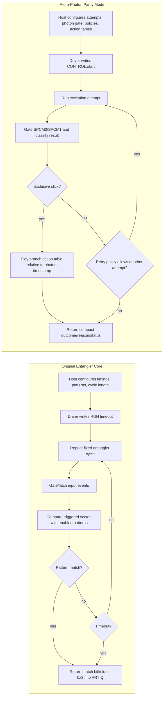
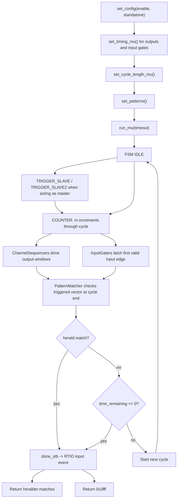
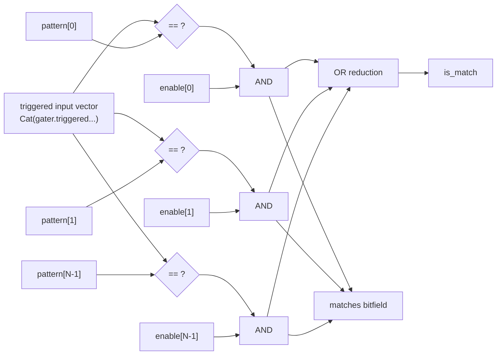
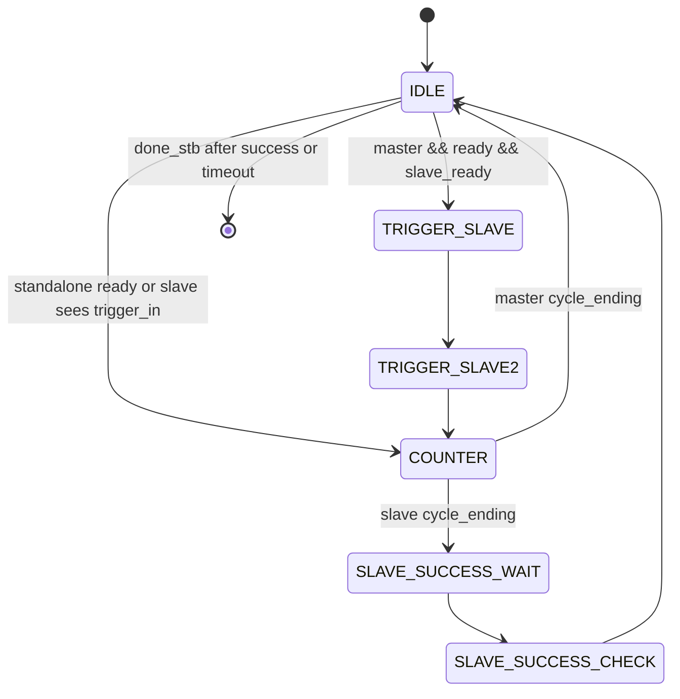
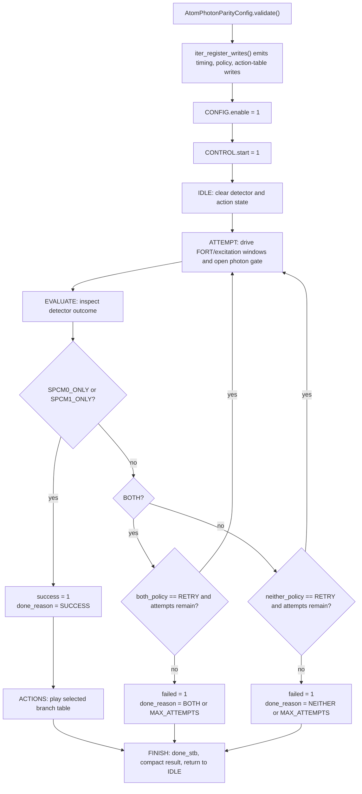
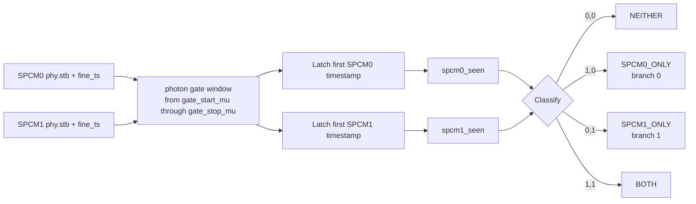
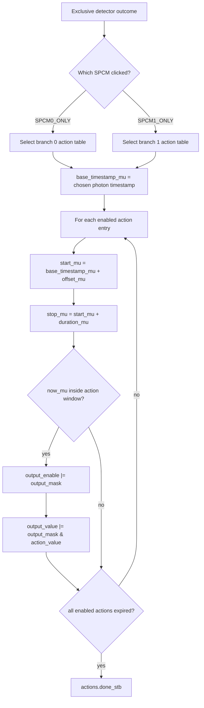

# Entangler Logic Across Branches

This note documents the two entangler logic paths currently relevant to this
workspace:

- Original core: `repos/madmax-entangler-core` branch `master`
  (`b7ab9f92a82697265c07f8961b3c1ea334beb4d1` locally).
- Atom-photon mode: branch `feature/atom-photon-parity-gateware-redesign`
  (`90b2b48aeb847670692e530f623203fbc3102f50` locally).

The `artiq-integration` branch keeps the legacy entangler model and adds local
ARTIQ integration fixes. It is not a separate experiment logic model in the same
way the atom-photon branch is.

## Required Passthrough Rule

Every custom Entangler or DIO-owning logic mode must provide a disabled
passthrough mode. This is required for every design.

- `enable = 0`: custom logic must be disabled or ignored, and DIO channels
  should behave like normal ARTIQ TTL inputs/outputs wherever physically
  possible.
- `enable = 1`: custom logic may own the channels it needs.
- Any channel that cannot be passed through must be explicitly documented and
  covered by tests.

The point is operational safety: flashing a custom gateware image should not make
a DIO card unusable for ordinary experiments whenever the custom mode is turned
off.

## Quick Comparison

| Area | Original branch | Atom-photon branch |
| --- | --- | --- |
| Primary files | `entangler/core.py`, `entangler/phy.py`, `entangler/driver.py` | `entangler/atom_photon_core.py`, `entangler/atom_photon_phy.py`, `entangler/atom_photon_driver.py`, `entangler/atom_photon_registers.py` |
| Goal | Repeat a fixed output/input-gate cycle until a detector pattern heralds success or a timeout expires | Keep photon-click classification and post-click branch actions in gateware for the atom-photon parity experiment |
| Inputs | Configurable number of entangler TTL inputs, optionally gated relative to a reference pulse | At least two SPCM inputs, treated as `SPCM0` and `SPCM1` |
| Outputs | Configurable sequencer outputs, plus optional running indicator | At least eight experiment action outputs with fixed suggested meanings |
| Success condition | Input trigger vector matches one of the configured herald patterns | Exactly one SPCM clicks during the photon gate |
| Non-success outcomes | Timeout only | `neither`, `both`, `max_attempts`, and `invalid_config` are explicit terminal reasons |
| Branching model | Pattern match ends the run and returns to ARTIQ kernel code | Hardware chooses branch 0 or branch 1 and plays timestamp-relative actions |
| Register style | Compact legacy address format with packed 16-bit start/stop timing words | Flat 8-bit addresses with full 32-bit machine-unit timing words |
| Inter-Kasli sync | Supports master/slave trigger, success, timeout, ready, and optional reference forwarding pins | Rejects `link_eem`/inter-Kasli sync in atom-photon mode |

## Visual Map

These diagrams use Mermaid so they can live directly in this Markdown file. The
flowcharts show the best mental model for each mode. The compact logic diagrams
show the places where the gateware is closer to combinational decision logic.



## Original Branch Logic

The original core is a reusable fixed-cycle entangler. The host configures output
pulse windows, input gate windows, cycle length, herald patterns, and a run
timeout. Once started, the gateware repeats the same cycle until a configured
input pattern is observed at cycle end or the timeout counter expires.

### Main Data Path

1. The ARTIQ driver writes configuration through `entangler/driver.py`.
2. The RTIO PHY wrapper in `entangler/phy.py` stores timing registers and starts
   `EntanglerCore`.
3. `EntanglerCore` instantiates:
   - one `MainStateMachine`,
   - one `ChannelSequencer` per output,
   - one input gater per entangler input,
   - one `PatternMatcher`.
4. Each cycle clears the input gaters and output sequencers.
5. Outputs pulse high during their configured cycle-relative windows.
6. Inputs latch the first valid rising edge in their configured gate windows.
7. At cycle end, the latched input-trigger vector is compared with all enabled
   herald patterns.
8. If any enabled pattern matches, the state machine records success and the PHY
   returns the matched pattern bitfield to the ARTIQ input FIFO.
9. If the coarse timeout counter reaches zero first, the PHY returns `0x3fff`.



### Output Sequencing

`ChannelSequencer` is intentionally simple. It watches the cycle counter `m`,
sets an internal output latch when `m == m_start`, clears it when `m == m_stop`,
and forces it low when `clear` is asserted. In hardware builds, each output pad
is driven by either the sequencer output or the normal ARTIQ passthrough signal:

- `enable = 0`: output pads behave like normal RTIO TTL outputs.
- `enable = 1`: output pads are owned by the entangler sequencers.

That pattern is mandatory for future custom modes. If a custom core uses a DIO
card, it must have an `enable = 0` path where the card behaves normally as far
as the design can support.

The driver accepts output timing in machine units, but output windows are shifted
to the coarse clock before being written. The practical output edge resolution is
therefore the coarse RTIO clock.

### Input Gating

There are two input-gater variants:

- `UntriggeredInputGater`: gate start/stop are absolute within the entangler
  cycle.
- `TriggeredInputGater`: gate start/stop are offsets from a reference input
  timestamp.

Both variants latch only the first signal edge in a valid window and report `0`
if no edge was captured. Input timestamps combine coarse cycle time with the
SERDES fine timestamp, so they retain fine machine-unit resolution.

The untriggered gater rejects invalid windows where:

- `gate_start < 8`,
- `gate_stop < 8`,
- or `gate_start >= gate_stop`.

### Pattern Matching

`PatternMatcher` receives a vector made from `gater.triggered` bits. It compares
that vector against each configured pattern and gates each comparison with the
corresponding pattern enable bit. `is_match` is true if any enabled comparison
matches.

The original driver packs patterns as:

```text
[enable bits][pattern N-1]...[pattern 1][pattern 0]
```

Each pattern is `NUM_ENTANGLER_INPUT_SIGNALS` bits wide.



### Main State Machine

`MainStateMachine` owns the repeated-cycle control loop:

- `IDLE`: wait for `ready` and, if acting as master, wait for slave readiness
  unless `standalone` is set.
- `TRIGGER_SLAVE` and `TRIGGER_SLAVE2`: assert the master-to-slave trigger for
  two cycles.
- `COUNTER`: increment cycle counter `m` until `cycle_length_input`.
- `SLAVE_SUCCESS_WAIT` and `SLAVE_SUCCESS_CHECK`: allow a slave to wait for
  master success propagation.

The state machine records success only at the end of a cycle. A herald that
arrives during the input gate does not stop the cycle immediately; it is latched
by the gater, matched at cycle end, and then the state machine finishes from
`IDLE`.

The run also ends if `time_remaining` reaches zero. Slave instances also accept
master timeout and success signals through the inter-Kasli link.



### Master/Slave Link

The legacy core can synchronize a master and slave entangler. The physical link
uses differential bidirectional buffers:

| Direction | Signal |
| --- | --- |
| Slave to master | slave ready |
| Master to slave | trigger |
| Master to slave | success |
| Master to slave | timeout |
| Optional slave to master | forwarded reference pulse |

This path matters for the remote-entanglement style experiment. It is not used
by the atom-photon parity mode.

### Original Register Interface

The original PHY derives its address width from the total number of input and
output channels:

```python
channel_bits = ceil(log2(num_inputs + num_outputs))
address_width = channel_bits + 2
```

The upper address bits select read/write and special/I-O access. Key writes are:

| Function | Meaning |
| --- | --- |
| `CONFIG` | enable output ownership, set master/slave, set standalone |
| `RUN` | write coarse timeout and pulse `run_stb` |
| `TCYCLE` | write coarse cycle length |
| `PATTERNS` | write packed herald patterns and enables |
| timing channels | write packed `[stop, start]` windows for outputs and inputs |

Key reads are:

| Function | Meaning |
| --- | --- |
| `STATUS` | ready, success, timeout bits |
| `NCYCLES` | cycles completed in the last run |
| `TIME_REMAINING` | remaining coarse timeout counter |
| `NTRIGGERS` | reference triggers seen, only meaningful with a reference PHY |
| timestamp reads | captured input timestamps, and optional reference timestamp |

## Atom-Photon Mode Logic

The atom-photon branch leaves the original core in place and adds a separate
experiment-specific path. Its purpose is to remove Python from the critical path
between photon detection and post-click microwave/RF/action timing.

Even for experiment-specific logic, disabled-mode passthrough remains required:
when the custom atom-photon sequencer is not enabled, the DIO channels it owns
must fall back to normal TTL behavior wherever possible.

The new core does not try to be a generic branch-on-event RTIO engine. It is a
small hardware sequencer shaped around the atom-photon parity experiment:

- run repeated excitation attempts,
- gate two SPCM inputs,
- classify the photon result,
- choose a branch after the photon gate closes,
- play branch-specific actions relative to the selected photon timestamp,
- return compact result/status words to the host.

### Main Data Path

1. Host code creates an `AtomPhotonParityConfig`.
2. `AtomPhotonParityConfig.iter_register_writes()` validates and emits register
   writes for timings, policies, and action tables.
3. `AtomPhotonEntangler` writes those registers through the RTIO PHY.
4. The host enables the PHY and starts the sequencer.
5. `AtomPhotonParityCore` repeats excitation attempts until success, failure, or
   max attempts.
6. On an exclusive SPCM click, the action sequencer plays the selected branch
   table relative to the chosen photon timestamp.
7. The PHY emits a done result and exposes result registers for later reads.



### Attempt Timing

`AtomPhotonParityCore` has one free-running coarse counter while active. Each
attempt uses an `attempt_start_mu` base time and compares elapsed time against
configured windows:

| Signal | Window |
| --- | --- |
| `fort_off` | `fort_off_mu <= elapsed < fort_on_mu` |
| `excitation_enable` | `excitation_start_mu <= elapsed < excitation_stop_mu` |
| `photon_gate_open` | `photon_gate_start_mu <= elapsed <= photon_gate_stop_mu` |

The core declares the configuration invalid if any of these conditions are true:

- `n_attempts == 0`,
- `fort_on_mu <= fort_off_mu`,
- `excitation_stop_mu <= excitation_start_mu`,
- `photon_gate_start_mu < 8`,
- `photon_gate_stop_mu <= photon_gate_start_mu`,
- `attempt_period_mu <= photon_gate_stop_mu`.

### Photon Detection

`PhotonEventDetector` watches two physical inputs:

- `input_phys[0]`: `SPCM0`,
- `input_phys[1]`: `SPCM1`.

It gates each input against an absolute photon window, latches the first valid
timestamp for each channel, and classifies the result as:

| Outcome | Meaning |
| --- | --- |
| `NEITHER` | no valid click |
| `SPCM0_ONLY` | only SPCM0 clicked |
| `SPCM1_ONLY` | only SPCM1 clicked |
| `BOTH` | both SPCM inputs clicked |
| `INVALID` | invalid configuration path |

Only `SPCM0_ONLY` and `SPCM1_ONLY` are success outcomes. `BOTH` and `NEITHER`
are policy controlled.



### Branch Policies

The core has independent policies for `neither` and `both`:

| Policy | Behavior |
| --- | --- |
| `RETRY` | start another attempt if attempts remain |
| `STOP_FAIL` | finish immediately with a failure reason |

If a retry policy is selected but no attempts remain, the terminal reason is
`MAX_ATTEMPTS`.

### Branch Action Sequencer

`TimestampRelativeActionSequencer` owns two action tables, one for each exclusive
SPCM branch. Each branch may contain up to `MAX_BRANCH_ACTIONS` entries. Each
entry has:

| Field | Meaning |
| --- | --- |
| `offset_mu` | start offset from the chosen photon timestamp |
| `duration_mu` | action duration |
| `output_mask` | which output bits this entry controls |
| `output_value` | output values while the entry is active |

At runtime, the sequencer selects branch 0 for `SPCM0_ONLY` and branch 1 for
`SPCM1_ONLY`. It computes `start_mu = chosen_timestamp_mu + offset_mu` and
`stop_mu = start_mu + duration_mu` for each entry. Output bits are active while
the coarse counter is within the entry window.

The host validator rejects action offsets that are too early to be safe after
exclusive branch classification. The current minimum is:

```python
photon_gate_stop_mu - photon_gate_start_mu + 32
```

That reflects the current non-speculative design: the hardware waits until the
photon gate closes before deciding whether the event was exclusive.



### Suggested Output Bit Mapping

The PHY exposes at least eight output bits. The branch defines these suggested
meanings:

| Bit | Meaning |
| --- | --- |
| 0 | FORT gate/off control during each attempt |
| 1 | excitation/GRIN gate during each attempt |
| 2 | microwave switch pulse |
| 3 | MW/RF switch or RF DDS switch |
| 4 | DDS/profile trigger |
| 5 | blow-away trigger |
| 6 | parity readout trigger |
| 7 | atom-check or recooling trigger |

Bits 0 and 1 are also driven directly by attempt timing. Branch actions can drive
the same output vector for post-click actions.

### Atom-Photon State Machine

`AtomPhotonParityCore` uses this FSM:

- `IDLE`: clear detector/action state and wait for `start_stb`.
- `ATTEMPT`: run one attempt until the photon gate has closed.
- `EVALUATE`: classify the detector result, either start branch actions, retry,
  or finish with failure.
- `ACTIONS`: wait for the action table to complete.
- `FINISH`: pulse `done_stb`, clear `running`, and return to `IDLE`.

Unlike the original core, a success does not simply return a pattern bitfield to
Python. It starts deterministic hardware actions first, then reports completion.

### Atom-Photon Register Interface

The atom-photon PHY uses fixed 8-bit register addresses. Writes with bit 7 clear
are configuration/control writes; reads use the `0x80` range.

Important writes:

| Address enum | Meaning |
| --- | --- |
| `CONFIG` | enable output ownership |
| `CONTROL` | bit 0 starts, bit 1 clears |
| `N_ATTEMPTS` | number of excitation attempts |
| `ATTEMPT_PERIOD_MU` | attempt spacing |
| `FORT_OFF_MU`, `FORT_ON_MU` | FORT timing window |
| `EXCITATION_START_MU`, `EXCITATION_STOP_MU` | excitation timing window |
| `PHOTON_GATE_START_MU`, `PHOTON_GATE_STOP_MU` | photon collection gate |
| `BRANCH_POLICIES` | neither policy in bit 0, both policy in bit 4 |
| `BRANCH0_ACTION_COUNT`, `BRANCH1_ACTION_COUNT` | number of action entries |
| action table registers | offset, duration, mask, value for each branch entry |

Important reads:

| Address enum | Meaning |
| --- | --- |
| `STATUS` | enable, running, success, failed, invalid_config |
| `OUTCOME` | final photon outcome |
| `DONE_REASON` | terminal reason code |
| `ATTEMPTS_COMPLETED` | number of attempts completed |
| `SPCM0_TIMESTAMP_MU` | first SPCM0 timestamp |
| `SPCM1_TIMESTAMP_MU` | first SPCM1 timestamp |
| `CHOSEN_TIMESTAMP_MU` | selected timestamp for branch action timing |
| `ATOM_CHECK_COUNTS` | reserved, currently returns 0 |

The PHY also emits a compact done result when `core.done_stb` fires. That result
packs final outcome, done reason, attempts completed, success, and failed flags.

### Current Limits Of Atom-Photon Mode

The atom-photon branch is a prototype path. Its current hardware boundary is:

- It handles excitation timing, photon detection, exclusive branch selection,
  retry/fail policy, and timestamp-relative post-click output actions.
- It reserves atom-check and recooling configuration fields, but does not yet
  implement the atom-retention counter loop.
- It does not perform waveplate movement, laser feedback, dataset bookkeeping,
  DDS SPI retunes, or Zotino DAC setpoint updates in gateware.
- It does not support the legacy master/slave inter-Kasli link.
- It requires at least two SPCM inputs and at least eight outputs.

## When To Use Which Logic

Use the original branch when the experiment is naturally described as:

- a repeated fixed output cycle,
- input gates that collect TTL detector events,
- one or more herald patterns,
- host-side work after `run_mu()` returns.

Use the atom-photon branch when the experiment needs:

- hardware classification of `SPCM0` versus `SPCM1`,
- deterministic post-click branch actions,
- repeated excitation attempts controlled by gateware,
- explicit `both` and `neither` handling,
- compact result reporting after the hardware finishes its branch actions.

The important conceptual split is this: the original entangler finds a herald and
then hands control back to Python; the atom-photon mode keeps control in
gateware long enough to perform the timing-critical reaction to the photon event.
